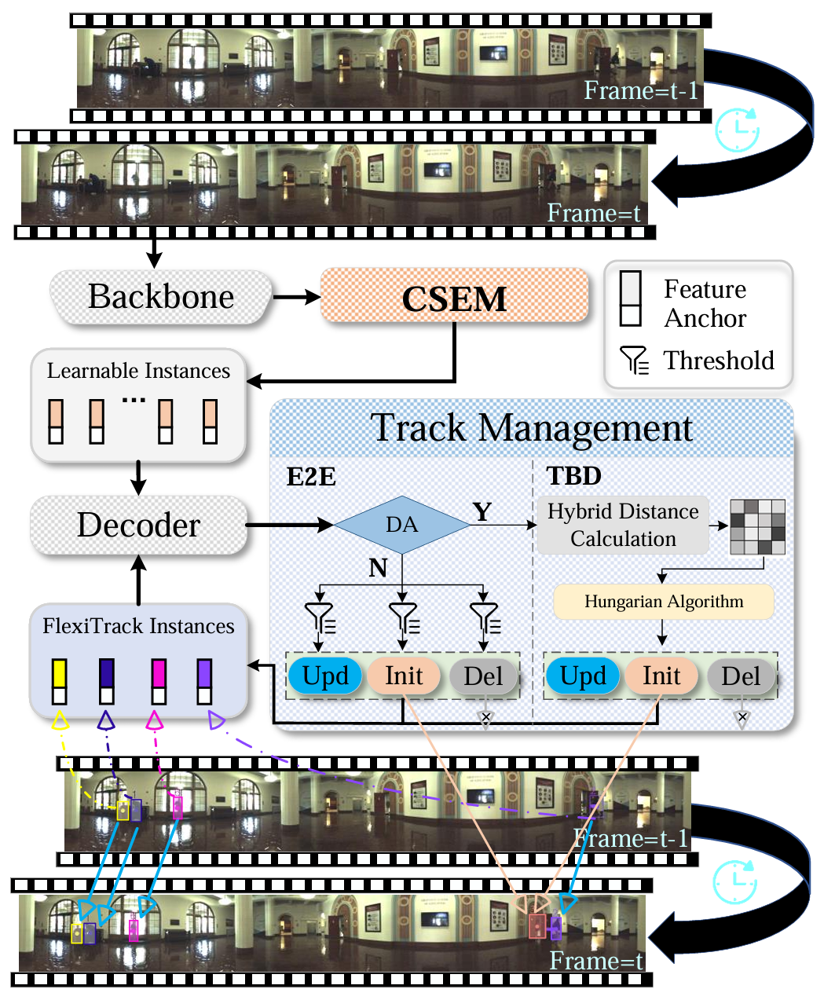

<!-- # OmniTrack
The official implementation of OmniTrack: Omnidirectional Multi-Object Tracking (CVPR 2025) -->

   
  
# OmniTrack: Omnidirectional Multi-Object Tracking (CVPR 2025)

## News
- [2025/02]: 🔥 OmniTrack is accepted by [CVPR 2025](https://cvpr2025.thecvf.com/).
- [2024/11]: OmniTrack achieve the SOTA on [JRDB MOT (Multi-Object Tracking) Task](http://www.semantic-kitti.org/tasks.html#ssc) with **26.92% HOTA** (Track-by-Detection)!
 

## Abstract
Panoramic imagery, with its 360° field of view,
 offers comprehensive information to support Multi-Object Tracking (MOT) in capturing spatial and temporal relationships of surrounding objects. However, most MOT algorithms are tailored for pinhole images with limited views, impairing their effectiveness in panoramic settings. Additionally, panoramic image distortions, such as resolution loss, geometric deformation, and uneven lighting, hinder direct adaptation of existing MOT methods, leading to significant performance degradation. To address these challenges, we propose OmniTrack, an omnidirectional MOT framework that incorporates Tracklet Management to introduce temporal cues, FlexiTrack Instances for object localization and association, and the CircularStatE Module to alleviate image and geometric distortions. This integration enables tracking in large field-of-view scenarios, even under rapid sensor motion. To mitigate the lack of panoramic MOT datasets, we introduce the QuadTrack dataset—a comprehensive panoramic dataset collected by a quadruped robot, featuring diverse challenges such as wide fields of view, intense motion, and complex environments. Extensive experiments on the public JRDB dataset and the newly introduced QuadTrack benchmark demonstrate the state-of-the-art performance of the proposed framework. OmniTrack achieves a HOTA score of 26.92\% on JRDB, representing an improvement of 3.43\%, and further achieves 23.45\% on QuadTrack, surpassing the baseline by 6.81\%. 
The dataset and code will be made publicly available.

## Demo

https://github.com/user-attachments/assets/2c9062ee-7148-4e00-bc63-a789a1b55b11

## Method

|  | 
|:--:| 
| ***Figure 1. The proposed OmniTrack pipeline**. CSEM refers to the CircularStatE Module, DA stands for data association, E2E denotes the End-to-End tracking paradigm, TBD refers to the Track-By-Detection tracking paradigm, Upd refers to updating tracks, Init to initializing tracks, and Del to deleting tracks.* |

## Dataset

- [x] JRDB
- [x] QuadTrack

